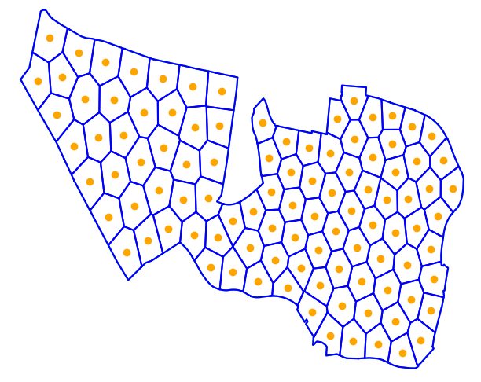
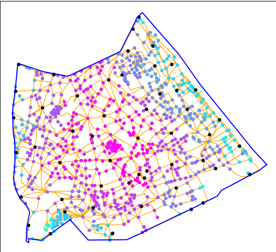
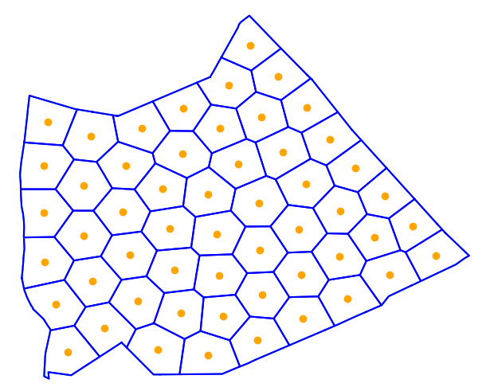
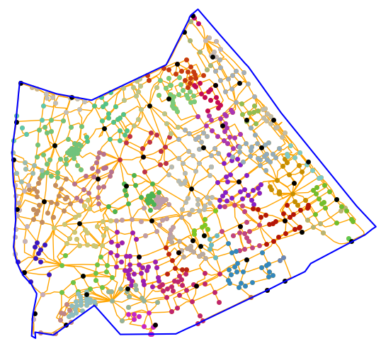
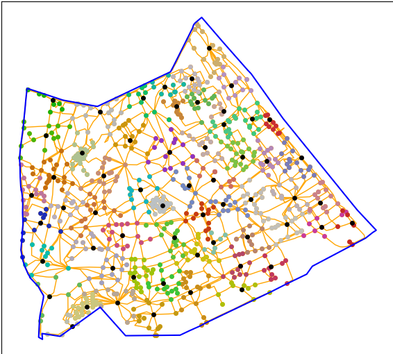
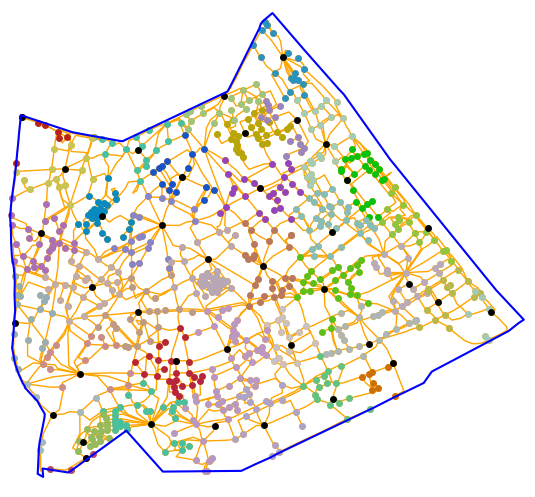

# Bike Station Optimizer

> Minimize the number of bike-sharing stations in a city while guaranteeing full coverage — applied to Paris.

A research project comparing **4 algorithms** for the optimal placement of bike stations, from a fast greedy heuristic to an exact linear program. Built in Python, tested on real OpenStreetMap data.

---

## Table of Contents

- [Problem Statement](#problem-statement)
- [Approaches](#approaches)
  - [Approach 1 — Spatial (Voronoï)](#approach-1--spatial-voronoï)
  - [Approach 2 — Graph-based](#approach-2--graph-based)
- [Results](#results)
- [Getting Started](#getting-started)
- [Project Structure](#project-structure)
- [Possible Improvements](#possible-improvements)

---

## Problem Statement

The goal is to place bike stations across a city such that:

- **Every point in the city is within a reasonable walking distance of a station** (300–400 m)
- **The total number of stations is minimized**

Two representations of the city are used:

| Representation | Zone modeled as | Stations modeled as |
|---|---|---|
| **Spatial** | A polygon (city boundary) | Points inside the polygon |
| **Graph** | G = (V, E) — intersections and roads | Vertices of the graph |

The graph-based approach is more realistic: distances follow actual streets rather than straight lines. Real-world walking distances are typically **~25% longer** than as-the-crow-flies distances.

---

## Approaches

### Approach 1 — Spatial (Voronoï)

Uses iterative **Voronoï diagrams** (Lloyd's algorithm) to partition the city into cells, each served by one station.

**Algorithm:**

```
points = random_points(n, city_boundary)
repeat until centroids stop moving:
    polygons = voronoi_diagram(points)
    for each polygon:
        points[i] = centroid(polygon[i])  # or polylabel if centroid is outside
return points, polygons
```

**Key detail:** Standard Lloyd's algorithm only works on convex polygons (centroids may fall outside concave cells). The fix is to replace out-of-polygon centroids with the **pole of inaccessibility** (center of the largest inscribed circle).

<p align="center">
  
  <br/>
  <em>The iteration give good results on complexes concaves figures</em>
</p>

The number of stations is found by **binary search** on cell size, targeting a radius of `dist / 1.25` to account for the detour factor.

**Initial estimate:**

```
n ≈ area / (π × distance²)
```

---

### Approach 2 — Graph-based

Three algorithms operate on the road network graph.

#### 2a. Greedy (concentric BFS)

Starting from the city center, the algorithm expands concentrically:

1. **Find candidate stations** — run a bounded Dijkstra from the current station, collecting all nodes at distance ~2d. These are potential next stations.
2. **Filter candidates** — from those candidates, pick a subset where each station is at distance ≥ 2d from the others.
3. **Expand** — repeat from each newly chosen station, never revisiting a node.

This runs in O(|S²|) time.

<p align="center">
  
  <br/>
  <em>Propagation of the algorithm from pink to light blue in Paris 13e</em>
</p>


#### 2b. K-Medoids

Requires a **precomputed all-pairs distance matrix** (Dijkstra from every node, O(|V|²)).

Then runs `fasterpam` (an optimized k-medoids implementation) with binary search on k to hit the target coverage distance:

```
repeat:
    k = (lo + hi) / 2
    result = fasterpam(distance_matrix, k)
    coverage = mean(max distance in each cluster)
    if coverage > target: increase k
    else: decrease k
```

#### 2c. Exact (Integer Linear Program)

Formulated as a **set cover** problem and solved with CPLEX:

**Variables:**
- `xᵢ ∈ {0,1}` — 1 if a station is placed at node i
- `yᵢⱼ ∈ {0,1}` — 1 if node j is covered by station i

**Objective:** minimize Σ xᵢ

**Constraints:**
- Every node j must be covered: `Σᵢ yᵢⱼ ≥ 1` for all j (summing over i with dᵢⱼ ≤ D)
- A node can only cover others if it has a station: `yᵢⱼ ≤ xᵢ` for all i, j

This gives the **provably optimal** solution but is computationally intractable for large graphs (>3h for zone 4 onward).

---

## Results

Tested on 6 zones of increasing size around Paris:

| Zone | Area | Nodes | Edges | Compute time (graph build) |
|---|---|---|---|---|
| 1 — Quartier Saint-Merri | tiny | 52 | 86 | 0.00032 s |
| 2 — Paris 13e | small | 788 | 1 415 | 0.14 s |
| 3 — Paris 13e+14e | medium | 1 456 | 2 617 | 0.53 s |
| 4 — Rive droite | large | 3 167 | 5 821 | 3.0 s |
| 5 — Rive gauche | large | 6 954 | 12 862 | 16 s |
| 6 — Paris (full) | very large | 10 097 | 18 680 | 36 s |

### Execution time (seconds)

| Method | Zone 1 | Zone 2 | Zone 3 | Zone 4 | Zone 5 | Zone 6 |
|---|---|---|---|---|---|---|
| Voronoï | 0.858 | 24.6 | 113.43 | 118.9 | 538 | 721 |
| **Greedy** | **0.013** | **0.203** | **0.434** | **0.731** | **0.78** | **2.46** |
| K-medoids | 0.00162 | 0.602 | 3.98 | 15.7 | 85.5 | 194 |
| Exact | 0.193 | 35.0 | 284 | >3h | ✗ | ✗ |

### Number of stations placed

| Method | Zone 1 | Zone 2 | Zone 3 | Zone 4 | Zone 5 | Zone 6 |
|---|---|---|---|---|---|---|
| Voronoï | 3 | 53 | 92 | 218 | 555 | 768 |
| Greedy | 4 | 62 | 102 | 244 | 630 | 891 |
| K-medoids | 4 | 58 | 103 | 232 | 583 | 817 |
| **Exact** | **3** | **38** | **67** | ✗ | ✗ | ✗ |

### Mean coverage distance (m) — target: 300 m

| Method | Zone 1 | Zone 2 | Zone 3 | Zone 4 | Zone 5 | Zone 6 |
|---|---|---|---|---|---|---|
| Voronoï | 340 | 303 | 301 | 299 | 298 | 300 |
| Greedy | 368 | 301 | 338 | 317 | 300 | 297 |
| K-medoids | 299 | 303 | 301 | 297 | 299 | 296 |
| Exact | 331 | 375 | 376 | ✗ | ✗ | ✗ |

### Standard deviation of coverage distance (m) — lower = more uniform

| Method | Zone 1 | Zone 2 | Zone 3 | Zone 4 | Zone 5 | Zone 6 |
|---|---|---|---|---|---|---|
| Voronoï | 423 | 39 | 30 | 39 | 125 | 73 |
| Greedy | 121 | 94 | 82 | 87 | 118 | 110 |
| K-medoids | 133 | 67 | 67 | 72 | 86 | 82 |
| **Exact** | **15** | **23** | **21** | ✗ | ✗ | ✗ |

### Proportion of nodes within acceptable distance

| Method | Zone 1 | Zone 2 | Zone 3 | Zone 4 | Zone 5 | Zone 6 |
|---|---|---|---|---|---|---|
| Voronoï | 0.966 | 0.994 | 0.994 | 0.995 | 0.996 | 0.997 |
| Greedy | 0.942 | 0.998 | 0.979 | 0.988 | 0.989 | 0.984 |
| K-medoids | 0.980 | 0.991 | 0.992 | 0.993 | 0.995 | 0.992 |
| **Exact** | **1.0** | **1.0** | **1.0** | ✗ | ✗ | ✗ |

### What does it look like (Paris 13e as an example)
<table align="center">
  <tr>
    <th align="center">Voronoï</th>
    <th align="center">Glouton</th>
  </tr>
  <tr>
    <td align="center"></td>
    <td align="center"></td>
  </tr>
  <tr>
    <td align="center"><em>53 stations — mean coverage 303 m</em></td>
    <td align="center"><em>62 stations — mean coverage 301 m</em></td>
  </tr>
  <tr>
    <th align="center">K-médoïdes</th>
    <th align="center">Exact</th>
  </tr>
  <tr>
    <td align="center"></td>
    <td align="center"></td>
  </tr>
  <tr>
    <td align="center"><em>58 stations — mean coverage 303 m</em></td>
    <td align="center"><em>38 stations — mean coverage 375 m</em></td>
  </tr>
</table>

### Summary

| Method | Speed | Station count | Coverage uniformity | Scalability |
|---|---|---|---|---|
| Voronoï | Slow | Good | Variable | Good |
| Greedy | **Very fast** | Acceptable | Acceptable | **Excellent** |
| K-medoids | Moderate | Good | Good | Moderate |
| Exact | Very slow | **Optimal** | **Excellent** | Poor |

**Takeaway:** For city-scale deployment, the **greedy** method offers the best speed/quality tradeoff. **K-medoids** gives better coverage uniformity at the cost of requiring a full distance matrix. The **exact** method is only feasible for small neighborhoods but provides a useful lower bound.

---

## Getting Started

### Prerequisites

```bash
pip install osmnx networkx igraph shapely numpy matplotlib kmedoids pulp colour
```

> **Note:** The exact solver (`optimisation_lineaire`) requires [IBM CPLEX](https://www.ibm.com/products/ilog-cplex-optimization-studio) (free academic license available). The other three methods have no such requirement.

### Quick start

```python
# main.py
city = "Paris"          # Any city name recognized by OpenStreetMap
dist = 300              # Max acceptable walking distance in meters
marge = dist/2            # Tolerance for greedy method
methode = "glouton"     # "glouton" | "kmedoids" | "voronoi" | "exact"

main(methode = methode, regenerate=True)
```

**First run** (`regenerate=True`) downloads the city graph from OpenStreetMap, processes it, and computes the full distance matrix (if `generate = True`) — this can take several minutes for large cities. Subsequent runs with `regenerate=False` load cached data instantly.

### Step by step

**1. Download and prepare the graph**

```python
city = "Paris, France"
crs = "EPSG:2154"
generate = True
regenerate = True

data = get_data(city, crs)
save_data(treat_graph(data[0], crs), data[1], file_name, generate=generate)
```

**2. Load the data**

```python
city = "Paris, France"
g_plot,h,polygon,mat=load_data(file_name, plot = True,igraph=True,polygone=True,matrix=True)
```
g_plot is a NetWorkX graph used for plotting, h is the igraph equivalent used for computation, polygon is the outbounds of the city, matrix the distance of the every node to every node in the graph.

**3. Run a method**

```python
facteur = 1.25 #estimated factor between euclidian distance and real distance
spatial_dist = dist/facteur
nb_iteration_kmedoids = 500
nb_iteration_voronoi = 500
methode = "glouton"  # "glouton" | "kmedoids" | "voronoi" | "exact"
main(methode = methode, regenerate)
```

**4. Evaluate results**

```python
from utils.stats import cluster, moyenne, ecart_type, correct_dist

clusters = cluster(h, stations, mat)
moy, maxs = moyenne(clusters, mat, stations)

print(f"Mean coverage:     {moy:.1f} m")
print(f"Std deviation:     {ecart_type(moy, maxs):.1f} m")
print(f"Coverage ratio:    {correct_dist(stations, mat, clusters, 0, dist):.3f}")
```
**5. plotting graphs**
This plot cluster per cluster

```python
colors= generate_random_color(len(stations),node_color="black") #methode from plotting_and_string_clean

cluster_points = [
    [[h.vs[j]['y'] for j in clusters[i]],
     [h.vs[j]['x'] for j in clusters[i]]]
    for i in range(len(clusters))
]

station_points = [[
    [h.vs[i]['y'] for i in stations],
    [h.vs[i]['x'] for i in stations]
]]

positions = cluster_points + station_points
plotting(g_plot,positions,interactive = False,color = colors,titre=titre)
plt.plot(*polygon.exterior.xy,"blue") #plot outbounds of the polygon
plt.show()
```

### Choosing a solver

| Situation | Recommended method |
|---|---|
| Quick estimate, any city size | `glouton` |
| Best coverage uniformity, city ≤ ~7k nodes | `kmedoids` |
| Spatial overview without reliable street graph | `voronoi` |
| Provably optimal, small area only | `exact` |

---

## Project Structure

```
bike-station-optimizer/
├── README.md
├── requirements.txt
├── main.py                        # Entry point — configure and run here
├── glouton_igraph.py              # Greedy concentric BFS algorithm
├── kmedoids.py                    # K-medoids with binary search
├── voronoi.py                     # Iterative Voronoï / Lloyd's algorithm
├── optimisation_lineaire.py       # Exact ILP formulation (requires CPLEX)
├── utils/
│   ├── plotting_and_string_clean.py   # Visualization + filename utilities
│   |── stats.py                       # Coverage metrics
|   ├── get_graph.py                   # OSM download, graph processing, data I/O
└── data/                          # Generated files (gitignored)
    ├── graph_<city>_geom.graphml
    ├── graph_<city>_simple.graphml
    ├── polygon_<city>.geojson
    └── matrice_<city>.npy
```

> The `data/` folder is not committed to git — it is generated locally on first run. Add it to `.gitignore`.

---

## Possible Improvements

Several real-world constraints were left out of scope and could be incorporated:

- **Station capacity** — not all locations can host the same number of bikes
- **Inter-station flow** — high-demand corridors (commutes, tourist areas) warrant denser coverage
- **Bike redistribution** — stations that regularly empty or fill up need logistics modelling
- **User behavior** — preferred routes and trip patterns could weight nodes differently
- **Elevation** — uphill walks are effectively longer; the distance metric could be adjusted

---

## References

- OpenStreetMap data via [OSMnx](https://github.com/gboeing/osmnx)
- K-medoids: [kmedoids Python package](https://github.com/kno10/python-kmedoids) (FasterPAM algorithm)
- ILP solver: [IBM CPLEX](https://www.ibm.com/products/ilog-cplex-optimization-studio) via [PuLP](https://github.com/coin-or/pulp)
- Pole of inaccessibility: [Shapely `polylabel`](https://shapely.readthedocs.io)
